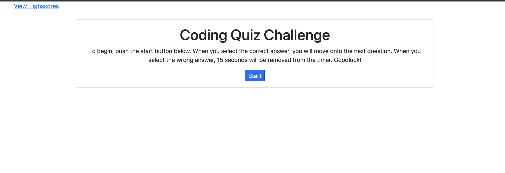

# Code Quiz:
Practice your coding knowledge with this coding quiz. Log your high score to see who can do the best.

# How to Use:
Hit the start button to begin the quiz. Select your answers as you go. If you get the right answer, you'll move
on to the next. If your answer is wrong, 15 seconds will be subtracted from the time. Log you score at the end to see where
you compare to others.

## Deployed Application Link

[https://hannamunoz.github.io/java.quiz/](https://hannamunoz.github.io/java.quiz/)